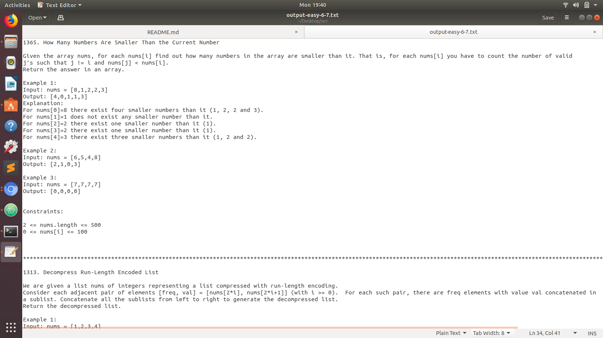

# Offline-Coding

## Problem:-

Sometimes due to low internet speed and electricity issues some of our friends fail to submit the problems given in the google sheet and they lack and get demotivated . <br/>

## Solution
We have devised a solution for this problem by making a web portal in which one can give the starting and ending range of the problem statement and the choice of the category ie. easy , medium and hard . All the problem statements will get downloaded in a .txt file which can be used anytime to solve the problem . Students can code the solution offline and can submit the problem later . <br/>

### Google sheets should be in the following format :
.png)


In this way , people can cope up with the problem and can utilise these quarantine days .

## Requirements <br/>

1) Install gspread from terminal using command <br/>
 > pip install gspread <br/>
2) Install beautiful Soup from terminal using command <br/>
> pip install beautifulsoup4
3) Install selenium from terminal using command <br/>
> pip install selenium

## How to run

Open index.html file and give the input in L, R and Choice of Sheet representing Lower and Upper Limit of cell
and Choice represents the choice of the sheet ie. easy , medium and hard . <br/>
### Follow this image for better understanding :


## Downloads txt file to mentioned path

### The output will be generated in a .txt file containing all problem statement in the given range :



## Running the tests

### Getting Started

These instructions will get you a copy of the project up and running on your local machine for development and testing purposes. See deployment for notes on how to deploy the project on a live system.

### Prerequisites

What things you need to install the software and how to install them

```
Give examples
```

### Installing

A step by step series of examples that tell you how to get a development env running
### Install Python

### Linux Users
It is very likely that you already have Python installed out of the box. To check if you have it installed (and which version it is), open a console and type the following command:

```
$ python3 --version
Python 3.6.1
```
### Windows Users
You can download Python for Windows from the website https://www.python.org/downloads/windows/. Click on the "Latest Python 3 Release - Python x.x.x" link. If your computer is running a 64-bit version of Windows, download the Windows x86-64 executable installer. Otherwise, download the Windows x86 executable installer. After downloading the installer, you should run it (double-click on it) and follow the instructions there.

One thing to watch out for: During the installation, you will notice a window marked "Setup". Make sure you tick the "Add Python 3.6 to PATH" or 'Add Python to your environment variables" checkbox and click on "Install Now".
And repeat
When the installation completes, you may see a dialog box with a link you can follow to learn more about Python or about the version you installed. Close or cancel that dialog -- you'll be learning more in this tutorial!

### Virtual environment
All you need to do is find a directory in which you want to create the virtualenv; your home directory, for example. On Windows, it might look like C:\Users\Name\ (where Name is the name of your login).

We will make a virtualenv called myvenv. The general command will be in the format:
```
$ python3 -m venv myvenv

```
### Working with virtualenv
The command above will create a directory called myvenv (or whatever name you chose) that contains our virtual environment (basically a bunch of directory and files).

### Working with virtualenv: Windows
Start your virtual environment by running:
```
C:\Users\Name\Krishi_Chaupal> myvenv\Scripts\activate
```
### Working with virtualenv: Linux and OS X
Start your virtual environment by running:
```
$ source myvenv/bin/activate
```
### Installing Django
Now that you have your virtualenv started, you can install Django.

Before we do that, we should make sure we have the latest version of pip, the software that we use to install Django:
```
(myvenv) ~$ python -m pip install --upgrade pip
```
Now, run pip install -r requirements.txt to install Django.
```
(myvenv) ~$ pip install -r requirements.txt
```
### Migrate Database
```
(myvenv) ~$ python manage.py migrate
```
### Migrations
```
(myvenv) ~$ python manage.py makemigrations
```
### Starting the web server
You need to be in the directory that contains the manage.py file. In the console, we can start the web server by running python manage.py runserver:
```
(myvenv) ~/Offline-Coding$ python manage.py runserver
```

 
